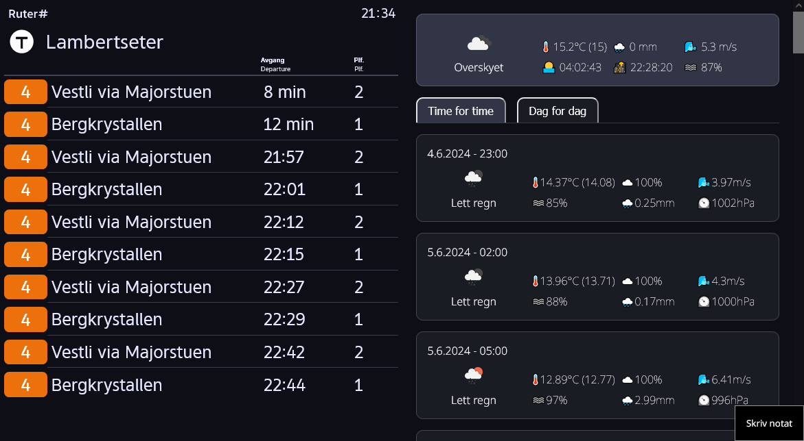

# leblet

Dette er noe simple hjemmemekka greier til en tablet jeg har hengt opp i
gangen med dobbeltsidig teip. Legges her fordi en kammerat var nysgjerrig
på koden, men antageligvis ikke til noe hjelp.

Den består av to iframes, en som viser tbane-avganger fra Lambertseter,
hvor jeg bor. Den andre som viser været i Oslo, via https://api.openweathermap.org

## EnTur

Dette er bare [tavla.entur.no](https://tavla.entur.no/) som du enkelt kan sette opp sjæl.

## Været

Jeg snakker med openweathermap.org. Du må sette opp din egen API-nøkkel for å bruke
denne. Bytt ut nøkkelen i filen `secrets.example.js` med din egen APP-id for å teste ut,
og rename filen til `secrets.js`.
NB: Det kan ta noe tid fra du har aktivert API-nøkkel til du kan bruke den, opp til
flere timer.

## Notater

Kona ville ha mulighet til å skrive notater også, så en knapp får opp en textarea
for notater. Det som skrives her lagres i localStorage, så du kan skru av KIOSK-appen
og så på igjen, og fremdeles se meldinger.

Personlig fant jeg en eller annen gratis KIOSK-app på Google Play som var gratis, og
som lot meg åpne web-sider som da er oppe helt til duppeditten går tom for strøm.
Duppeditten jeg bruker er en gammel Lenovo-tablet jeg fant på finn.no

## Lisens

Hvis du stjeler og bruker denne koden i produksjon må du oppsøke psykolog.

## FAQ

**Du er shenial åssen klarte du å skrive alt dette helt sjæl?**

Jeg har fått god drahjelp fra både Chat GPT og Copilot. Chat GPT hjalp meg å finne
API, KIOSK-app, emojier til ulike vær-fenomener, med mer. Copilot auto-completa
halve sjelen min.

**Hva er greia med exampleresponse.js?!**

Når jeg har den fila liggende, så klarer Copilot lettere å foreslå hva jeg skal
gjøre med retur-objektene fra openweather.org. Spesielt fordi jeg brukte de to
objektene i denne filen når jeg skrev HTML-koden, og plugget på APIet senere. :-)
